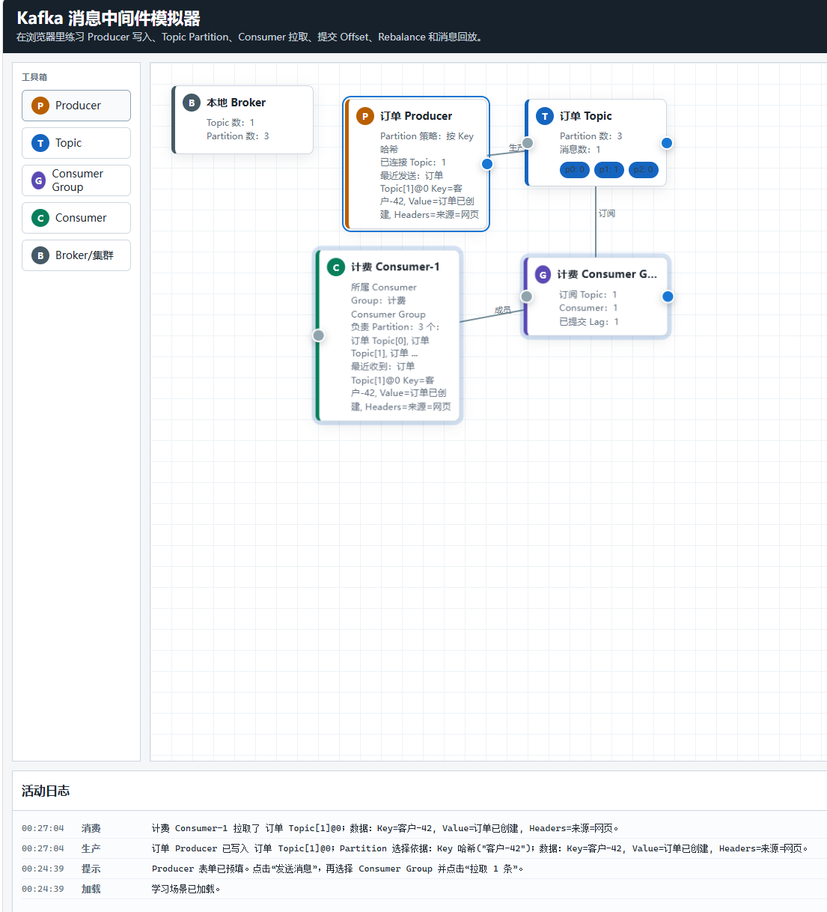

# Kafka Simulator

这是一个完全 vibe coding 出来的 Kafka 可视化学习项目。

项目目标不是实现真实 Kafka Broker，也不是做生产级管理后台，而是帮助初学者通过图形化方式理解 Kafka 作为消息中间件时的核心概念和运行方式。

在线访问：

https://xuyudong.github.io/kafka-simulator/

## 界面预览



这个界面把 Kafka 的核心对象画成可以拖拽和连线的卡片：`Producer` 写入 `Topic`，`Topic` 按 `Partition` 保存消息，`Consumer Group` 将 `Partition` 分配给不同 `Consumer`，底部活动日志会打印生产和消费的消息数据。

## 适合谁

- 刚开始学习 Kafka 的同学
- 想理解 Producer、Topic、Partition、Consumer Group、Consumer、Offset、Lag 的人
- 想通过拖拽、连线、发送消息、消费消息来观察 Kafka 行为的人
- 不想一上来就被真实 Kafka 集群、命令行和配置文件劝退的人

## 可以学到什么

- Producer 如何把消息写入 Topic
- Topic 如何拆成多个 Partition
- Key 哈希、轮询、指定 Partition 对消息落点的影响
- Consumer Group 如何把 Partition 分配给不同 Consumer
- 为什么同一个 Consumer Group 内，一个 Partition 同时只能由一个 Consumer 消费
- Offset 是什么，Consumer Group 如何通过 Offset 表示读取位置
- Lag 是什么，为什么消息生产和消费速度不一致时会产生 Lag
- Consumer 拉取消息不会删除 Topic 中的消息
- Seek / Reset Offset 如何实现历史消息回放

## 核心功能

- 拖拽创建 Kafka 拓扑节点
- 支持 Producer、Topic、Consumer Group、Consumer、Broker/集群节点
- 支持节点之间连线
- 支持发送消息并展示 Key / Value / Headers
- 支持 Topic Partition 可视化
- 支持 Consumer Group 分区分配、Offset、Lag 展示
- 支持单条拉取、批量拉取、提交 Offset、Seek、Reset
- 支持多个内置学习场景
- 支持画布缩放，方便放大阅读卡片和连线
- 支持保存、读取、导入、导出 JSON 场景

## 本地运行

这是纯静态项目，不需要安装依赖。

直接打开 `index.html`，或者启动一个本地静态服务：

```bash
python -m http.server 8765
```

然后访问：

```text
http://127.0.0.1:8765/
```

## 项目定位

这个项目只模拟 Kafka 的核心学习模型：

- 不连接真实 Kafka
- 不实现 Kafka 协议
- 不做生产环境监控
- 不做权限、认证、多用户协作
- 不保证覆盖 Kafka 的所有高级特性

它更像一个交互式白板，用来帮助你先把 Kafka 的基本运行模型看懂。
